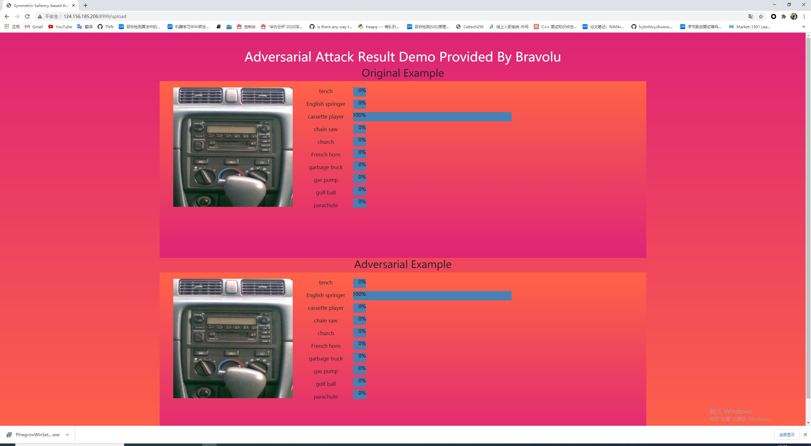
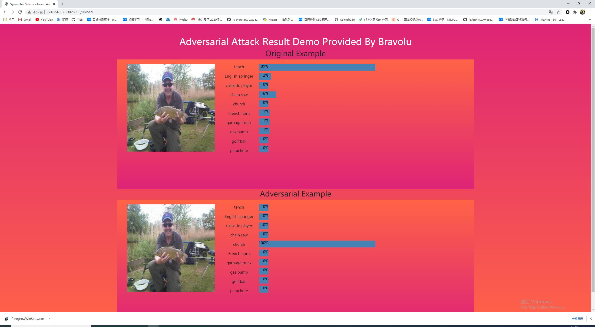

# Adversarial Attack Demo

This demo is based on [Cartoonizer](https://github.com/Toon-It/Cartoonizer) and [SSAE](https://github.com/BravoLu/SSAE)

## Installation 

You can refer to [Cartoonizer-it](https://github.com/Toon-It/Cartoonizer)

## Usage 

1. Deploy the demo application on your server. 
```shell
python deploy.sh
```

2. Use browser and input corresponding ip:port.
3. Upload original images then click "upload". (We provide some original examples)

* The demo is based on resnet18.

## Some results



